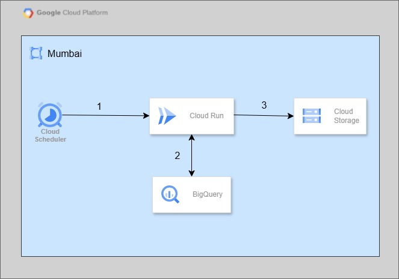

# GCP Serverless IAM Audit Report Generator

This repository contains the implementation for an automated, serverless solution designed to generate monthly GCP IAM and Access review reports. The system replaces manual spreadsheet tracking by consolidating data from **Cloud Asset Inventory** and **BigQuery** to produce a formatted CSV report stored in **Cloud Storage**.

## Architecture Overview

The system utilizes a cost-effective, serverless architecture.



1.  **Cloud Scheduler**: Triggers the entire process on a defined schedule (e.g., the 1st of every month).
2.  **Cloud Run Function**: Executes the Python logic (`main.py`) to extract resource and policy data using the Cloud Asset Inventory API.
3.  **BigQuery**: Serves as the transformation engine, joining raw IAM policies with project metadata to generate human-readable reports.
4.  **Cloud Storage**: Stores the final timestamped CSV report, which is ready for audit purposes.

## Prerequisites & Permissions

A custom Service Account (`iam-auditor-sa`) must be created to ensure the principle of least privilege is followed.

### Service Account Roles

The service account requires the following roles:

  * **Organization Level**:
      * `Cloud Asset Viewer`
      * `Cloud Asset Insights Viewer` (Required to search policies across all projects)
  * **Project Level (Hosting Project)**:
      * `BigQuery Admin` (To create and overwrite audit tables)
      * `Storage Admin` (To write the final CSV to the bucket)
      * `Cloud Run Admin`
      * `Artifact Registry Reader`
      * `Service Account User`

## Implementation Steps

### Step 1: Resource Setup

Create the necessary BigQuery dataset and Cloud Storage bucket. All resources should be created in the `asia-south1` region.

``` bash
# Create BigQuery Dataset
bq --location=asia-south1 mk -d iam_audit_dataset

# Create Cloud Storage Bucket
gsutil mb -l asia-south1 gs://iam-audit-report

```

### Step 2: Internal Data Structures (BigQuery)

The automation manages two key tables within the `iam_audit_dataset`:

  * **`raw_iam_data`**: A staging table that stores the raw results of the `search_all_iam_policies` API call.
  * **`final_monthly_report`**: The transformed table containing the joined data and sequential indexing ready for export.

### Step 3: Deploy the Cloud Run Function

Deploy the function using the **2nd Generation** runtime to accommodate the potential 540s timeout required for long-running BigQuery jobs.

**Key Deployment Configurations:**

  * Location: `asia-south1`
  * Networking ingress: `internal`
  * Authentication: `IAM`
  * Service Account: Use the custom service account (`iam-auditor-sa`) created earlier to deploy the application.

### Step 4: Automate with Cloud Scheduler

Create a Cloud Scheduler job to trigger the Cloud Run endpoint monthly. Replace `[YOUR_CLOUD_RUN_URL]` and `[PROJECT_ID]` placeholders.

``` bash
gcloud scheduler jobs create http iam-monthly-audit-job \
  --schedule="0 0 1 * *" \
  --uri="[YOUR_CLOUD_RUN_URL]" \
  --http-method=POST \
  --oidc-service-account-email="iam-audit-invoker@[PROJECT_ID].iam.gserviceaccount.com" \
  --oidc-token-audience="[YOUR_CLOUD_RUN_URL]" \
  --location="asia-south1"

```

## Report Data Structure

The final generated CSV report includes the following columns, designed specifically for compliance reviews:

| **Column**                        | **Description**                                                 |
| :-------------------------------: | :-------------------------------------------------------------: |
| **SL\_No**                        | Audit index (1, 2, 3...) for the entire report from BQ.         |
| **Project\_Name**                 | The human-readable Display Name of the project.                 |
| **Roles**                         | The full IAM role string.                                       |
| **Nos**                           | Total count of distinct members holding that role.              |
| **Associated\_Users**             | Comma-separated list of human email addresses.                  |
| **Associated\_Service\_Accounts** | Comma-separated list of service account emails.                 |
| **Description**                   | A simplified, readable version of the role name.                |
| **Privileged\_User\_YN**          | Flag ('Y'/'N') for high-impact roles (Owner, Editor, Admin).    |
| **Remarks**                       | Indicates if the role is 'Project Wise' or 'For the entire OU'. |